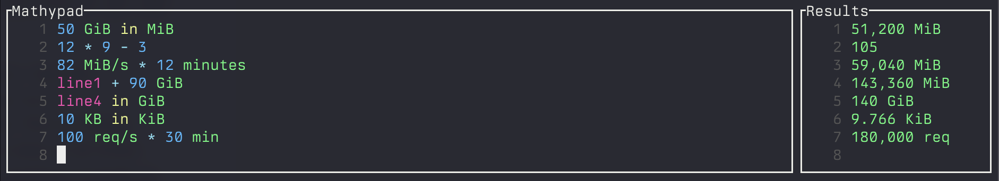

# Mathypad

A smart TUI calculator that understands units and makes complex calculations
simple.



## What is it?

Mathypad is like a notepad where you can write math expressions with real-world
units, and it automatically calculates results for you. Think "Google
calculator" or [Soulver][soulver] but for your terminal, with support for data
sizes, time, and API performance metrics.

[soulver]: https://soulver.app/

## Quick Start

```bash
# Cargo install
cargo install mathypad

# Clone and build
git clone https://github.com/pato/mathypad.git
cd mathypad
cargo build --release
cargo install --path .
```


```bash
# start the editor
mathypad
```

```bash
# Or use it directly from command line
mathypad -- "100 QPS * 1 hour"           # → 360,000 query
mathypad -- "5 GB to GiB"                # → 4.657 GiB
mathypad -- "1 TB/s * 30 minutes"        # → 1,800 TB
```

## Why You'll Love It

### Smart Unit Handling
No more mental math converting between GB and GiB, or calculating how many requests your API serves per day:

```
50 GiB/s * 1 hour                    → 180,000 GiB
100 QPS to requests per day          → 8,640,000 req
2 TB + 500 GB                        → 2,500 GB
1 PB to TiB                          → 909,494.702 TiB
```

### Real-World Problem Solving
Perfect for DevOps, data engineering, and capacity planning:

```bash
# How much storage for 6 months of logs?
100 MB/day * 180 days                → 18,000 MB

# API capacity planning
500 QPS * 1 year                     → 15,778,800,000 query

# Data transfer estimates  
10 Gbps to TB/hour                   → 4.5 TB/h

# Storage consolidation
5 TB + 2.5 TB + 1024 GiB             → 8.524 TB
```

### Interactive or One-Shot
Use it like a notepad with live results, or fire quick calculations from your terminal:

**Interactive Mode (with vim motions):**
```
$ mathypad
┌─ Mathypad ────────────────────┬─ Results ─────────────┐
│   1 │ 100 QPS * 8 hours       │   1 │ 2,880,000 query │
│   2 │ line1 / 1000            │   2 │ 2,880 query     │
│   3 │ 50 GB to GiB            │   3 │ 46.566 GiB      │
│   4 │                         │   4 │                 │
└── NORMAL ─────────────────────┴─────┴─────────────────┘

• ESC → Normal mode (hjkl navigation, indicator at bottom)
• i/a/o → Insert mode for editing
• Ctrl+C/Ctrl+Q → Quit
```

**Command Line:**
```bash
mathypad -- "1.5 EB / 100 Gbps"         → 33.333 h
```

## What It Handles

### Data Units
- **Decimal**: B, KB, MB, GB, TB, PB, EB
- **Binary**: KiB, MiB, GiB, TiB, PiB, EiB
- **Rates**: All the above + /s (e.g., GB/s, TiB/s)

### Performance Metrics
- **QPS**: queries per second, minute, hour
- **Request rates**: req/s, req/min, requests/hour
- **Load calculations**: QPS × time = total requests

### Time
- Seconds, minutes, hours, days
- Mix and match: `90 minutes + 1.5 hours = 240 min`

## Complex Operations Made Simple

### Data Center Planning
```
# Total monthly bandwidth
1 PB/day * 30 days                   → 30 PB

# Storage requirement with replication  
100 TB * 3 replicas + 20% overhead   → 360 TB

# Network utilization
50 Gbps * 0.8 utilization to TB/day  → 432 TB/day
```

### API Performance Analysis
```
# Peak load calculation
1000 QPS * 1.5 peak_multiplier       → 1,500 QPS

# Monthly request volume
250 QPS * 30 days                    → 648,000,000 query

# Load balancer distribution
5000 QPS / 10 servers                → 500 QPS
```

### Mixed Unit Calculations
```
# Different storage types
2 TiB SSD + 8 TB HDD                 → 10.196 TB

# Cross-base conversions
1000 GB * 0.931 to GiB               → 931 GiB

# Rate × time calculations
100 MiB/s * 2 hours to GiB           → 703.125 GiB
```

### Conversion Chains
```
# Multi-step conversions
24 MiB * 32 servers in GB            → 0.805 GB
5000 queries / 10 minutes to QPS     → 8.333 QPS
(1 TiB + 500 GiB) / 8 hours          → 0.052 TiB/s
```

## Advanced Features

### Line References
Reference previous calculations in your notepad:
```
Line 1: 100 TB
Line 2: line1 * 0.8                  → 80 TB
Line 3: line2 to TiB                 → 72.760 TiB
```

### Smart Parsing
It figures out what you mean:
```
Transfer: 5 PB in 2 days             → 28.935 TB/s
API load during peak: 2000 QPS       → 2,000 QPS
Storage needed: 500 GB * 12 months    → 6,000 GB
```

### Flexible Syntax
Use "to" or "in" for conversions:
```
1 GB to MiB                          → 953.674 MiB
100 TB * 3 in PB                     → 0.3 PB
```

## Installation

Requires [Rust](https://rustup.rs/):

```bash
git clone https://github.com/pato/mathypad.git
cd mathypad
cargo build --release
```

Or run directly:
```bash
mathypad                         # Interactive mode
mathypad -- "your calculation"   # One-shot mode
```

## Use Cases

- **DevOps**: Storage capacity planning, bandwidth calculations
- **Data Engineering**: Dataset size estimates, transfer time calculations  
- **API Design**: Rate limiting, capacity planning, load testing
- **System Administration**: Resource allocation, performance monitoring
- **General Computing**: Any calculation involving data sizes or rates

## Why Not Just Use a Regular Calculator?

```bash
# Traditional way:
# 1. Convert 1 PB to bytes: 1,000,000,000,000,000
# 2. Divide by bytes per GiB: 1,000,000,000,000,000 ÷ 1,073,741,824
# 3. Get: 931,322.574615479

# Mathypad way:
1 PB to GiB                          → 931,322.575 GiB
```

Much better, right?

## Developed using AI 🤖

This was developed using Claude Code (with 3.5 Haiku and Sonnet 4) for a grand
total of $25.60

Every commit has alongside with it the prompt I used that generated the
contents of the commit (with the exception of commits marked as no ai, but
there was no code that wasn't written by the model).

```
> /cost
  ⎿  Total cost:            $25.60
     Total duration (API):  1h 45m 33.9s
     Total duration (wall): 23h 21m 24.6s
     Total code changes:    3518 lines added, 610 lines removed
     Token usage by model:
         claude-3-5-haiku:  405.9k input, 21.2k output, 0 cache read, 0 cache write
            claude-sonnet:  2.4k input, 213.9k output, 47.4m cache read, 2.1m cache write
```
